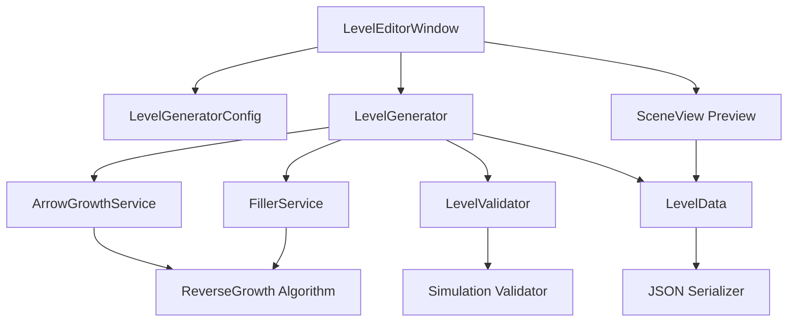

# Level Editor 요구사항 문서 (PRD)

## 문서 정보
- 버전: 1.0.0
- 최종 수정일: 2026-01-23
- 프로젝트명: Balloon Out (WSB_BalloonOut)
- 작성자: AI Assistant
- 관련 문서:
  - MVP: Assets/Documents/WSB_MVP.md
  - Algorithm: Assets/Documents/WSB_LevelEditor_Algorithm.md
- 문서 상태: 초안

### AI 협업 가이드라인
- 이 PRD는 HTML 프로토타입의 ReverseGrowth 알고리즘(v8)을 Unity로 포팅하기 위한 요구사항 문서입니다.
- Unity Editor Window 기반 Level Editor 도구 개발에 초점을 맞춥니다.

---

## 1. Level Editor 개요

### 1.1. 목표 및 핵심 기능

**Level Editor 목표**:
- HTML 프로토타입의 자동 레벨 생성 알고리즘을 Unity Editor 도구로 구현
- 100% Solvable 퍼즐 자동 생성
- 50-80% 밀도 달성
- JSON 형식 레벨 데이터 저장/로드

**핵심 기능**:
1. **ReverseGrowth 알고리즘**: 꺾이는 화살표 자동 생성
2. **순차적 의존성 배치**: 풀 수 있는 퍼즐 보장
3. **밀도 제어**: Filler 시스템으로 목표 밀도 달성
4. **실시간 미리보기**: Scene View에서 생성 결과 확인

### 1.2. 개발 환경 및 범위

- **Unity 버전**: 2022.3.69f1 LTS
- **렌더 파이프라인**: 2D (Core) 또는 2D URP
- **대상**: Unity Editor (개발 도구)

**구현 범위**:
- **포함**: 자동 생성, 파라미터 UI, 미리보기, JSON 저장/로드
- **제외 (Phase 2)**: 수동 편집, PNG 변환, 드래그 앤 드롭

---

## 2. 시스템 구조

### 2.1. 전체 시스템 다이어그램



### 2.2. 핵심 기능 요구사항

| 시스템 ID | 기능명 | 주요 동작 | 우선순위 |
|---|---|---|---|
| LE_001 | Level Generator | 파라미터 기반 레벨 자동 생성 | P0 |
| LE_002 | Arrow Growth | ReverseGrowth 알고리즘 | P0 |
| LE_003 | Filler System | 빈 공간 채우기 | P0 |
| LE_004 | Level Validator | 풀 수 있는지 검증 | P0 |
| LE_005 | Editor Window | 파라미터 UI | P0 |
| LE_006 | Scene Preview | Gizmos 미리보기 | P1 |
| LE_007 | JSON I/O | 저장/로드 | P0 |

### 2.3. 시스템별 상세 구현 계획

---

#### LE_001: Level Generator

**설명**: 파라미터를 받아 레벨 데이터를 생성하는 메인 컨트롤러

**구현 전략**:
1. Config에서 파라미터 읽기
2. Queue 생성 (Lane × BalloonsPerLane)
3. 색상 순서 결정 (Queue + Miss)
4. 순차적 의존성 배치
5. Filler 추가 (밀도 조절)
6. Validator로 검증
7. LevelData 반환

**필수 구성요소**:
```csharp
public class LevelGenerator
{
    // 설정
    private LevelGeneratorConfig _config;

    // 서비스
    private ArrowGrowthService _arrowGrowth;
    private FillerService _filler;
    private LevelValidator _validator;

    // 메인 생성 함수
    public LevelData Generate(LevelGeneratorConfig config);

    // 내부 함수
    private List<List<GameColor>> GenerateQueue();
    private List<GameColor> GetColorSequence(List<List<GameColor>> lanes, int missCount);
    private bool TryPlaceArrow(GameColor color, int length, List<ArrowData> placed);
}
```

**기대 동작**:
1. Generate() 호출 시 최대 50회 시도
2. 각 시도에서 순차적으로 화살표 배치
3. 검증 통과 시 LevelData 반환
4. 실패 시 예외 발생

**테스트 기준**:
- 100회 생성 시 95% 이상 성공
- 생성된 모든 레벨이 Validator 통과

---

#### LE_002: Arrow Growth Service (ReverseGrowth)

**설명**: 꺾이는 화살표를 Head에서 반대 방향으로 성장시키는 알고리즘

**구현 전략**:
1. Head 위치와 탈출 방향 결정
2. 성장 방향 = OPPOSITE[headDir]
3. 목표 길이까지 셀 추가
4. 직진 우선, 막히면 좌/우 시도

**핵심 상수**:
```csharp
public static class DirectionHelper
{
    public static readonly Dictionary<Direction, Vector2Int> Vectors = new()
    {
        { Direction.U, new Vector2Int(0, -1) },  // Y 증가 = 아래 (Unity 좌표 변환 필요)
        { Direction.D, new Vector2Int(0, 1) },
        { Direction.L, new Vector2Int(-1, 0) },
        { Direction.R, new Vector2Int(1, 0) }
    };

    public static readonly Dictionary<Direction, Direction[]> TurnPriority = new()
    {
        { Direction.U, new[] { Direction.U, Direction.L, Direction.R } },
        { Direction.D, new[] { Direction.D, Direction.R, Direction.L } },
        { Direction.L, new[] { Direction.L, Direction.D, Direction.U } },
        { Direction.R, new[] { Direction.R, Direction.U, Direction.D } }
    };

    public static readonly Dictionary<Direction, Direction> Opposite = new()
    {
        { Direction.U, Direction.D },
        { Direction.D, Direction.U },
        { Direction.L, Direction.R },
        { Direction.R, Direction.L }
    };
}
```

**필수 구성요소**:
```csharp
public class ArrowGrowthService
{
    /// <summary>
    /// ReverseGrowth 방식으로 화살표 경로 생성
    /// </summary>
    public ArrowGrowthResult GrowArrowReverse(
        Vector2Int headPos,
        Direction headDir,
        int targetLength,
        HashSet<Vector2Int> occupied,
        int gridSize);

    /// <summary>
    /// 다음 성장 셀 찾기 (직진 > 좌/우)
    /// </summary>
    private (Vector2Int pos, Direction dir)? FindNextGrowthCell(
        Vector2Int current,
        Direction preferredDir,
        HashSet<Vector2Int> occupied,
        int gridSize);

    /// <summary>
    /// 그리드 가장자리 위치 (즉시 탈출 가능)
    /// </summary>
    public List<Vector2Int> GetEdgePositions(Direction dir, int gridSize);
}

public struct ArrowGrowthResult
{
    public List<Vector2Int> Path;
    public Direction HeadDir;
    public bool IsBending;
}
```

**기대 동작**:
1. Head 위치에서 반대 방향으로 성장 시작
2. 직진 가능하면 직진
3. 직진 불가 시 좌/우 중 랜덤 선택
4. 뒤로 가기(180도 회전) 금지
5. 최소 2칸 이상 성장해야 유효

**테스트 기준**:
- 빈 그리드에서 targetLength 길이 화살표 생성
- 장애물 있을 때 우회 경로 생성
- 막다른 길에서 null 반환

---

#### LE_003: Filler Service

**설명**: 목표 밀도 달성을 위해 빈 공간에 추가 화살표 배치

**구현 전략**:
1. 현재 밀도 계산
2. 목표 밀도까지 반복
3. 랜덤 위치에 Filler 화살표 배치
4. Bending 모드 지원

**필수 구성요소**:
```csharp
public class FillerService
{
    public List<ArrowData> PlaceFillersForDensity(
        List<ArrowData> existingArrows,
        HashSet<Vector2Int> occupied,
        LevelGeneratorConfig config);

    private float CalculateDensity(int occupiedCells, int gridSize);
}
```

---

#### LE_004: Level Validator

**설명**: 생성된 레벨이 풀 수 있는지 시뮬레이션으로 검증

**구현 전략**:
1. 모든 화살표 복사
2. 탈출 가능한 화살표 찾기
3. 탈출 순서 기록
4. 모든 화살표 탈출 시 성공

**필수 구성요소**:
```csharp
public class LevelValidator
{
    public ValidationResult Validate(
        List<ArrowData> arrows,
        List<List<GameColor>> lanes,
        int gridSize);
}

public struct ValidationResult
{
    public bool IsValid;
    public string FailReason;  // "deadlock", "timeout", etc.
    public List<int> EscapeSequence;  // 실제 탈출 순서
    public bool QueueCleared;
}
```

**탈출 판정 로직**:
```
for each arrow in remaining:
  head = arrow.Path[0]
  dir = arrow.Direction
  escapePath = cells from head to grid edge in dir
  if escapePath intersects no other arrows:
    mark as escapable
```

---

#### LE_005: Editor Window

**설명**: Unity Editor에서 레벨 생성 파라미터를 설정하는 UI

**구현 전략**:
1. EditorWindow 상속
2. SerializedProperty로 파라미터 바인딩
3. Generate 버튼으로 생성 실행
4. Save/Load 버튼으로 JSON 관리

**UI 레이아웃**:
```
┌─────────────────────────────────────────┐
│ Level Generator v1.0                    │
├─────────────────────────────────────────┤
│ Grid Size:     [IntSlider: 5-12]        │
│ Target Density: [Slider: 20%-80%]       │
├─── Queue Settings ──────────────────────┤
│ Lanes:         [2]  [Toggle: Auto]      │
│ Balloons/Lane: [3]  [Toggle: Auto]      │
│ Miss Arrows:   [2]  [Toggle: Auto]      │
├─── Arrow Settings ──────────────────────┤
│ Min Length:    [3]  [Toggle: Auto]      │
│ Max Length:    [8]  [Toggle: Auto]      │
├─── Mode Settings ───────────────────────┤
│ [Toggle] Bending Mode                   │
│ [Toggle] Enable Filler                  │
├─────────────────────────────────────────┤
│ [Button: Generate] [Button: Clear]      │
│ [Button: Save]     [Button: Load]       │
├─────────────────────────────────────────┤
│ Status: Ready / Generating... / Done    │
│ Density: 65.2% | Arrows: 12 | Fillers: 5│
└─────────────────────────────────────────┘
```

**필수 구성요소**:
```csharp
public class LevelEditorWindow : EditorWindow
{
    [MenuItem("Tools/Balloon Out/Level Editor")]
    public static void ShowWindow();

    private LevelGeneratorConfig _config;
    private LevelData _currentLevel;
    private LevelGenerator _generator;

    private void OnGUI()
    {
        DrawGridSettings();
        DrawQueueSettings();
        DrawArrowSettings();
        DrawModeSettings();
        DrawButtons();
        DrawStatus();
    }

    private void Generate();
    private void Save();
    private void Load();
    private void Clear();
}
```

---

#### LE_006: Scene Preview

**설명**: 생성된 레벨을 Scene View에서 Gizmos로 미리보기

**구현 전략**:
1. SceneView.duringSceneGui 이벤트 구독
2. Handles API로 그리드 그리기
3. 화살표 색상별 렌더링
4. 탈출 순서 번호 표시

**필수 구성요소**:
```csharp
public class LevelPreviewHandler
{
    private LevelData _level;

    public void DrawLevel(LevelData level)
    {
        DrawGrid(level.GridSize);
        foreach (var arrow in level.Arrows)
        {
            DrawArrow(arrow);
        }
    }

    private void DrawGrid(int size);
    private void DrawArrow(ArrowData arrow);
    private void DrawOrderNumber(ArrowData arrow);
}
```

---

#### LE_007: JSON I/O

**설명**: 레벨 데이터를 JSON 형식으로 저장/로드

**저장 경로**: `Assets/Resources/Levels/`

**JSON 형식**:
```json
{
  "name": "Level_001",
  "gridSize": 8,
  "lanes": [
    ["R", "G", "B"],
    ["Y", "R", "G"]
  ],
  "arrows": [
    {
      "x": 5,
      "y": 2,
      "color": "R",
      "direction": "L",
      "length": 4,
      "path": [
        {"x": 5, "y": 2},
        {"x": 4, "y": 2},
        {"x": 3, "y": 2},
        {"x": 3, "y": 3}
      ],
      "order": 1,
      "isFiller": false
    }
  ],
  "stats": {
    "density": 0.65,
    "mainArrows": 8,
    "fillers": 4
  }
}
```

**필수 구성요소**:
```csharp
public static class LevelSerializer
{
    private const string LevelPath = "Assets/Resources/Levels/";

    public static void SaveLevel(LevelData level, string filename);
    public static LevelData LoadLevel(string filename);
    public static List<string> GetLevelList();
}
```

---

## 3. 데이터 구조

### 3.1. Core Data Classes

```csharp
public enum Direction { U, D, L, R }

public enum GameColor { R, G, Y, B, P }  // Red, Green, Yellow, Blue, Purple

[Serializable]
public class LevelData
{
    public string Name;
    public int GridSize;
    public List<List<GameColor>> Lanes;
    public List<ArrowData> Arrows;
    public LevelStats Stats;
}

[Serializable]
public class ArrowData
{
    public Vector2Int HeadPosition;
    public Direction Direction;
    public GameColor Color;
    public int Length;
    public List<Vector2Int> Path;  // 꺾이는 화살표용
    public int Order;              // 탈출 순서
    public bool IsFiller;
    public bool IsBending;
}

[Serializable]
public class LevelStats
{
    public float Density;
    public int MainArrows;
    public int Fillers;
    public int TotalArrows;
}
```

### 3.2. Config ScriptableObject

```csharp
[CreateAssetMenu(fileName = "LevelGenConfig", menuName = "BalloonOut/Level Generator Config")]
public class LevelGeneratorConfig : ScriptableObject
{
    [Header("Grid")]
    [Range(5, 12)] public int GridSize = 8;

    [Header("Queue")]
    [Range(1, 6)] public int LaneCount = 2;
    [Range(1, 8)] public int BalloonsPerLane = 3;
    [Range(0, 10)] public int MissArrowCount = 2;

    [Header("Arrow Length")]
    [Range(1, 8)] public int MinBlockLength = 3;
    [Range(2, 20)] public int MaxBlockLength = 8;

    [Header("Density")]
    [Range(0.2f, 0.8f)] public float TargetDensity = 0.5f;

    [Header("Filler")]
    public bool FillerEnabled = true;
    [Range(1, 6)] public int FillerMinLength = 2;
    [Range(2, 8)] public int FillerMaxLength = 5;

    [Header("Mode")]
    public bool BendingEnabled = true;
    [Range(0f, 1f)] public float BendingChance = 1.0f;

    [Header("Auto Parameters")]
    public bool AutoLanes = true;
    public bool AutoBalloons = true;
    public bool AutoMiss = true;
    public bool AutoLength = true;

    // Auto 값 계산
    public void CalculateAutoParams()
    {
        // Grid 크기 기반 자동 계산
        // WSB_LevelEditor_Algorithm.md 참조
    }
}
```

---

## 4. 좌표계 변환

### 4.1. HTML vs Unity 좌표

```
HTML 좌표:          Unity 2D 좌표:
(0,0)───────►       ▲
│                   │
│  Y 증가           │  Y 증가
▼                   │
                    (0,0)───────►
```

**변환 공식**:
```csharp
// HTML → Unity
public static Vector2Int HtmlToUnity(int htmlX, int htmlY, int gridSize)
{
    return new Vector2Int(htmlX, gridSize - 1 - htmlY);
}

// Unity → HTML
public static (int x, int y) UnityToHtml(Vector2Int unityPos, int gridSize)
{
    return (unityPos.x, gridSize - 1 - unityPos.y);
}
```

### 4.2. 방향 변환

```csharp
// HTML에서 U(위) = Unity에서 D(아래)
public static Direction ConvertDirection(Direction htmlDir)
{
    return htmlDir switch
    {
        Direction.U => Direction.D,
        Direction.D => Direction.U,
        _ => htmlDir  // L, R은 동일
    };
}
```

---

## 5. 구현 우선순위

### 5.1. Phase 1: 핵심 알고리즘 (P0)

| 순서 | 시스템 | 예상 시간 |
|------|--------|-----------|
| 1 | Data Classes (LevelData, ArrowData) | 2시간 |
| 2 | LevelGeneratorConfig (ScriptableObject) | 2시간 |
| 3 | ArrowGrowthService (ReverseGrowth) | 4시간 |
| 4 | LevelValidator (Simulation) | 3시간 |
| 5 | LevelGenerator (Main Logic) | 4시간 |

### 5.2. Phase 2: Editor UI (P0)

| 순서 | 시스템 | 예상 시간 |
|------|--------|-----------|
| 6 | LevelEditorWindow (Basic UI) | 3시간 |
| 7 | FillerService | 2시간 |
| 8 | JSON Serializer | 2시간 |

### 5.3. Phase 3: 미리보기 및 개선 (P1)

| 순서 | 시스템 | 예상 시간 |
|------|--------|-----------|
| 9 | SceneView Preview (Gizmos) | 3시간 |
| 10 | Auto Parameter Calculation | 2시간 |
| 11 | 버그 수정 및 최적화 | 4시간 |

---

## 6. 테스트 계획

### 6.1. 단위 테스트

| 테스트 | 시나리오 | 성공 조건 |
|--------|----------|-----------|
| ReverseGrowth | 빈 그리드에서 길이 5 화살표 | Path.Count == 5 |
| ReverseGrowth | 장애물 우회 | 유효한 경로 생성 |
| Validator | 풀 수 있는 레벨 | IsValid == true |
| Validator | 데드락 레벨 | IsValid == false, FailReason == "deadlock" |

### 6.2. 통합 테스트

| 테스트 | 시나리오 | 성공 조건 |
|--------|----------|-----------|
| 레벨 생성 | 8x8, 밀도 50% | 생성 성공, 밀도 45-55% |
| 레벨 생성 | 100회 반복 | 95회 이상 성공 |
| JSON 저장/로드 | 생성 → 저장 → 로드 → 비교 | 데이터 동일 |

### 6.3. 성능 테스트

| 테스트 | 조건 | 목표 |
|--------|------|------|
| 생성 시간 | 12x12 그리드 | < 1초 |
| 메모리 | 100개 레벨 로드 | < 50MB |

---

## 7. 참고 자료

### 7.1. HTML 프로토타입 파일

| 파일 | 설명 |
|------|------|
| `PrototypeAlgorithm/generator.js` | ReverseGrowth 알고리즘 원본 |
| `PrototypeAlgorithm/game.js` | Snake 이동 로직 |
| `PrototypeAlgorithm/algorithm-history.md` | 알고리즘 개발 히스토리 |

### 7.2. 참조 문서

- [WSB_LevelEditor_Algorithm.md](WSB_LevelEditor_Algorithm.md): 알고리즘 상세
- [WSB_MVP.md](WSB_MVP.md): 게임 MVP 문서

### 7.3. 기존 ArrowPopBall 프로젝트 참조

| 파일 | 참고 내용 |
|------|-----------|
| `Editor/LevelEditorWindow.cs` | Editor UI 패턴 |
| `Game/Grid/GridSystem.cs` | 그리드 좌표 시스템 |
| `Data/LevelData.cs` | 데이터 구조 |

---

## 변경 이력

| 버전 | 날짜 | 변경 내용 | 작성자 |
|------|------|-----------|--------|
| 1.0.0 | 2026-01-23 | 최초 작성 | AI Assistant |

---

## 부록: 빠른 참조

### A. 핵심 체크리스트

- [ ] ReverseGrowth 알고리즘 구현
- [ ] 순차적 의존성 배치 로직
- [ ] Filler 시스템
- [ ] Validator (시뮬레이션)
- [ ] Editor Window UI
- [ ] JSON 저장/로드
- [ ] SceneView 미리보기

### B. 핵심 알고리즘 요약

```
1. Queue 생성: Lane × BalloonsPerLane 색상 배열
2. 색상 순서: Queue 역순 + Miss 삽입
3. 첫 화살표: 그리드 가장자리에 배치 (즉시 탈출 가능)
4. 이후 화살표: 이전 화살표 Body에 막히는 위치에 배치
5. Filler: 목표 밀도까지 빈 공간에 추가
6. 검증: 시뮬레이션으로 풀 수 있는지 확인
7. 실패 시: 다시 시도 (최대 50회)
```

### C. 방향 우선순위 (TURN_PRIORITY)

```
U(위): [U, L, R]     (아래 금지)
D(아래): [D, R, L]   (위 금지)
L(왼쪽): [L, D, U]   (오른쪽 금지)
R(오른쪽): [R, U, D] (왼쪽 금지)
```