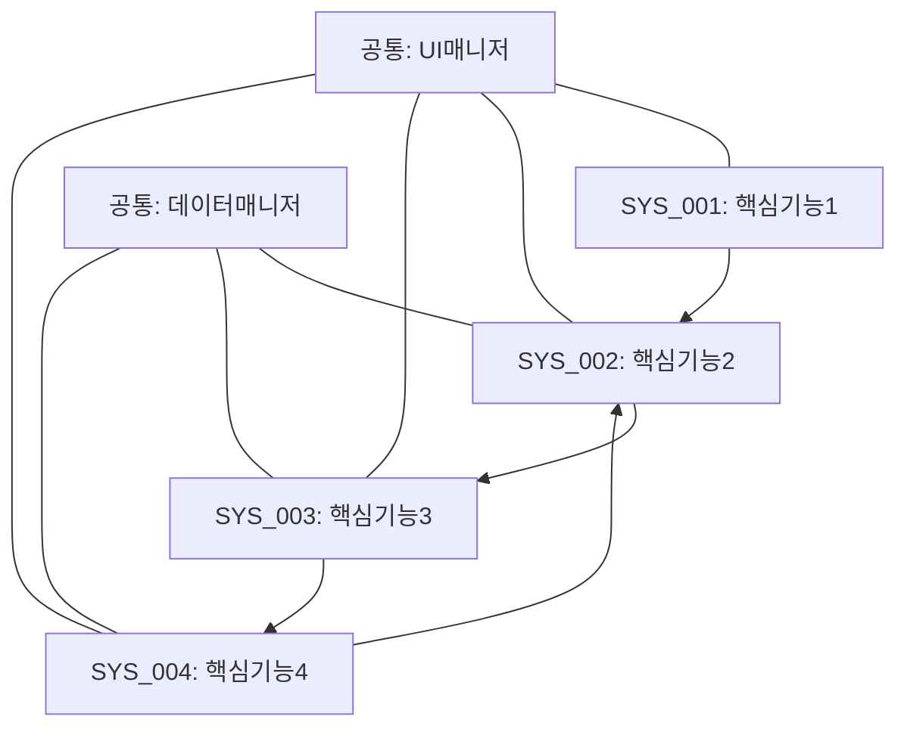
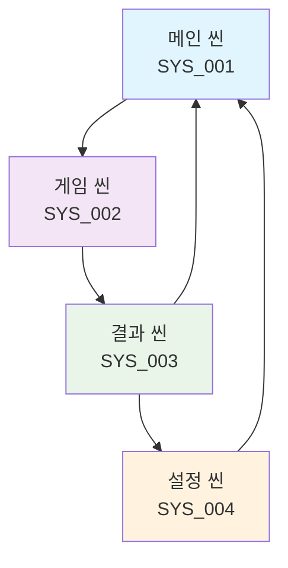

# 프로토타입 요구사항 문서 (PRD) - 하이브리드 템플릿

## 문서 정보
- 버전: [x.y.z]
- 최종 수정일: [YYYY-MM-DD]
- 프로젝트명: [MVP에서 정의된 프로젝트명]
- 작성자: AI Assistant (사용자 확인 필요)
- 관련 문서: (경로 다를 수 있음)
  - MVP: Assets/Documentation/MVP/MVP.md
  - GDD: Assets/Documentation/GDD/GDD.md (사용자가 GDD를 제공했을 경우)
- 문서 상태: [초안/검토중/승인됨]
- 시스템 ID: [프로젝트 식별자]

### AI 협업 가이드라인
- 이 PRD는 사용자가 제공한 MVP (및 GDD) 문서를 기반으로 AI가 생성합니다.
- AI는 사용자가 확인하고 승인한 PRD의 내용에 따라서만 프로토타입을 구현합니다.
- 내용이 명확하지 않거나 MVP와 불일치하는 부분이 있다면 AI에게 수정을 요청하세요.
- **프로토타입 중심**: 빠른 검증과 반복 개발에 최적화된 구조를 따릅니다.

---

## 1. 프로토타입 개요

### 1.1. 프로토타입 목표 및 핵심 메커니즘
**프로토타입 목표**: [프로토타입의 핵심 목표와 검증하고자 하는 내용을 1-2문장으로 설명. MVP의 'AI 프로토타이핑 중점 사항'을 기반으로 AI가 구체화합니다.]

**핵심 메커니즘**:
1. **[메커니즘 1]**: [MVP 기반 핵심 메커니즘 설명]
2. **[메커니즘 2]**: [MVP 기반 핵심 메커니즘 설명]
3. **[메커니즘 3]**: [MVP 기반 핵심 메커니즘 설명]

### 1.2. 개발 환경 및 범위
- **Unity 버전**: [프로젝트에 설정된 Unity 버전]
- **렌더 파이프라인**: [프로젝트에 설정된 렌더 파이프라인 (예: URP)]
- **대상 플랫폼**: Android (APK 빌드 우선) - [화면 방향]
- **최소 사양**: [필요시 기재]

**프로토타입 범위**:
- **포함**: [프로토타입에 포함될 핵심 기능들 - MVP 기반]
- **제외**: [의도적으로 제외된 기능들 - 프로토타입 범위 외]

---

## 2. 시스템 구조 및 핵심 기능

### 2.1. 전체 시스템 다이어그램



### 2.2. 핵심 기능 요구사항 및 시스템 매핑

| 시스템 ID | 핵심 기능명 | 주요 동작 | 소속 씬 | 우선순위 | 필요 프리팹 |
|---|---|---|---|---|---|
| SYS_001 | [핵심 기능 1] | [주요 동작 요약] | [씬 이름] | 상 | [프리팹1, 프리팹2] |
| SYS_002 | [핵심 기능 2] | [주요 동작 요약] | [씬 이름] | 상 | [프리팹3, 프리팹4] |
| SYS_003 | [핵심 기능 3] | [주요 동작 요약] | [씬 이름] | 중 | [프리팹5, 프리팹6] |
| SYS_004 | [핵심 기능 4] | [주요 동작 요약] | [씬 이름] | 중 | [프리팹7, 프리팹8] |

### 2.3. 시스템별 상세 구현 계획

#### SYS_001: [핵심 기능 1 이름 - MVP에서 정의된 핵심 기능 1]
**설명**: [기능 상세 설명]

**구현 전략/주요 단계**:
1. [1단계]: [구체적 구현 내용]
2. [2단계]: [구체적 구현 내용]
3. [3단계]: [구체적 구현 내용]
4. [4단계]: [통합 및 테스트]

**필수 구성요소**:
- **컴포넌트/스크립트**: [컴포넌트명1], [컴포넌트명2]
- **필요한 프리팹**: 
  - **기존**: [GDD에서 정의된 기존 프리팹, 예: `Popup_Option.prefab`]
  - **신규**: [새로 생성할 프리팹 및 기능 설명]
- **필요한 에셋**: [에셋 목록 또는 플레이스홀더]

**기대 동작**:
1. [단계별 동작 설명 - 사용자 시나리오 기반]
2. [단계별 동작 설명]
3. [단계별 동작 설명]

**테스트 기준**:
- **테스트 방법**: [사용자가 MVP 검증을 위해 어떻게 이 기능을 테스트할 수 있는지 명확히 기술]
- **성공 조건**: [구체적 판단 기준]

#### SYS_002: [핵심 기능 2 이름]
[SYS_001과 동일한 구조로 작성]

#### SYS_003: [핵심 기능 3 이름]
[SYS_001과 동일한 구조로 작성]

#### SYS_004: [핵심 기능 4 이름]
[SYS_001과 동일한 구조로 작성]

---

## 3. 기술적 요구사항

### 3.1. 프로젝트 구조
> **AI 및 사용자 참고**: 실제 프로젝트에 적용되는 표준 폴더 구조는 `.cursor/README.md` 문서의 '기본 설정' 또는 '프로젝트 구조' 섹션에 상세히 기술되어 있으니, 해당 문서를 우선적으로 참조하여 일관성을 유지해주세요.

```plaintext
Assets/
├── Art/                  # 모든 시각적 에셋
│   ├── 2D/
│   ├── 3D/
│   ├── Animations/
│   ├── Fonts/
│   ├── Materials/
│   ├── Shaders/
│   └── Textures/
│   └── UI/               # UI 스프라이트, 아이콘 등
├── Audio/                # 모든 사운드 에셋
│   ├── Music/
│   └── SFX/
├── Documentation/          # 프로젝트 문서
│   ├── MVP/                # MVP 문서
│   ├── PRD/                # PRD 문서
│   ├── GDD/                # GDD 문서
│   └── Progress/           # 진행 상황 기록
├── Editor/               # 커스텀 에디터 스크립트 (필요시)
├── Plugins/              # 외부 플러그인 (필요시)
├── Prefabs/              # 재사용 가능한 게임 오브젝트
│   ├── Characters/
│   ├── Environment/
│   ├── Items/
│   └── UI/               # UI 프리팹
├── Resources/            # Resources.Load를 통해 로드할 에셋 (신중히 사용)
├── Scenes/               # 게임 씬 파일
│   ├── Levels/
│   └── TestScenes/       # 개발/테스트용 씬
├── Scripts/              # 모든 C# 스크립트
│   ├── Core/             # 게임의 핵심 시스템
│   ├── Gameplay/         # 개별 게임플레이 로직
│   ├── Managers/         # 게임 매니저 스크립트
│   ├── UI/               # UI 제어 스크립트
│   └── Utilities/        # 범용 유틸리티 스크립트
└── Settings/             # ScriptableObjects, 프로젝트 전반 설정 파일 등 (필요시)
```

### 3.2. 기존 프리팹 에셋
**GDD 작성 내용 및 AI와의 협의를 통해 프로토타입에 사용하기로 최종 확정된 기존 프리팹 목록:**

| 프리팹 경로 | 용도 | 적용 시스템 | 상세 설명 참조 |
|---|---|---|---|
| `Assets/Prefabs/UI/Popup_Option.prefab` | 설정 메뉴 팝업 | SYS_COM_001 | `.cursor/assets/Popup_Option.md` |
| `Assets/Prefabs/UI/[프리팹명].prefab` | [용도 설명] | [시스템 ID] | `.cursor/assets/[문서명].md` |
| `Assets/Prefabs/Game/[프리팹명].prefab` | [용도 설명] | [시스템 ID] | `.cursor/assets/[문서명].md` |

**각 프리팹의 상세 설명은 `.cursor/.cursorassets` 파일에서 링크된 `.cursor/assets/` 폴더 내 해당 마크다운 문서를 참조하세요.**

### 3.3. 사용할 라이브러리/패키지
**프로토타입 구현에 필수적인 라이브러리만 명시합니다.**

- **DOTween** (선택사항)
  - 버전: [최신 안정 버전]
  - 용도: UI 애니메이션 및 트윈 효과
  - 주요 API: DOMove, DOFade, DOScale

- **TextMeshPro** (Unity 기본 포함)
  - 용도: 향상된 텍스트 렌더링
  - 주요 기능: 다국어 지원, 글꼴 효과

### 3.4. 플레이어 입력 처리 방식
- **Unity Input System 사용 여부**: [예/아니오]
- **주요 Input Action Asset 경로**: `Assets/Settings/Input/PlayerInputActions.inputactions`

**주요 Actions 및 Bindings**:
| Action 이름 | 기본 Binding (키보드/마우스) | 기본 Binding (게임패드) | 적용 시스템 |
|---|---|---|---|
| Move | WASD / Arrow Keys | Left Stick | [시스템 ID] |
| Jump | Spacebar | South Button (A) | [시스템 ID] |
| Interact | E Key | East Button (B) | [시스템 ID] |
| Menu | ESC | Start Button | [시스템 ID] |
| Select | Mouse Click / Enter | South Button (A) | [시스템 ID] |

### 3.5. 필수 컴포넌트 및 매니저
**프로토타입에서 공통으로 사용되는 핵심 컴포넌트:**

```csharp
// 게임 매니저 - 전체 게임 상태 관리
public class GameManager : MonoBehaviour
{
    public static GameManager Instance { get; private set; }
    
    // 게임 상태 관리
    private GameState currentState;
    
    // 씬 간 데이터 전달
    public void ChangeScene(string sceneName, object data = null) { ... }
    public T GetSceneData<T>() where T : class { ... }
}

// UI 매니저 - 공통 UI 관리
public class UIManager : MonoBehaviour
{
    public static UIManager Instance { get; private set; }
    
    // 팝업 관리
    public void ShowPopup<T>(T popupPrefab) where T : MonoBehaviour { ... }
    public void HidePopup() { ... }
    
    // 페이드 효과
    public void FadeIn(float duration = 1f) { ... }
    public void FadeOut(float duration = 1f) { ... }
}
```

### 3.6. 임시 해결책/플레이스홀더
**AI가 프로토타이핑 속도를 위해 사용하는 임시 방편들:**

| 항목 | 현재 구현 | 향후 개선점 |
|---|---|---|
| 아트 에셋 | Unity 기본 프리미티브 사용 | `Assets/Art/` 폴더의 실제 에셋으로 교체 |
| 오디오 | 빈 AudioSource 또는 기본 클립 | `Assets/Audio/` 폴더의 실제 오디오로 교체 |
| 애니메이션 | 간단한 DOTween 효과 | 전문 애니메이터와 Timeline 사용 |
| 데이터 저장 | PlayerPrefs 사용 | JSON 파일 또는 데이터베이스 연동 |

---

## 4. 씬 구조 및 전환

### 4.1. 씬 구조 다이어그램



### 4.2. 씬별 구성 요소 및 구현 전략

#### [메인 씬] (SYS_001)
**주요 컴포넌트**: [GameManager], [UIManager], [MainMenuController]
**UI 요소**: [시작 버튼], [설정 버튼], [종료 버튼]
**필요 프리팹**: [MainMenu.prefab], [Popup_Option.prefab]

**구현 전략/주요 단계**:
1. **씬 기본 설정**: 카메라, 조명, UI 캔버스 배치
2. **매니저 초기화**: GameManager, UIManager 싱글톤 설정
3. **메뉴 UI 구성**: 버튼 배치 및 이벤트 연결
4. **씬 전환 로직**: 다른 씬으로의 전환 구현

#### [게임 씬] (SYS_002)
[메인 씬과 동일한 구조로 작성]

#### [결과 씬] (SYS_003)
[메인 씬과 동일한 구조로 작성]

#### [설정 씬] (SYS_004)
[메인 씬과 동일한 구조로 작성]

### 4.3. 씬 간 전환 및 데이터 전달

```csharp
// 씬 전환 표준 패턴
public class SceneTransition
{
    public static IEnumerator TransitionToScene(string sceneName, object data = null)
    {
        // 1. 데이터 저장
        if (data != null)
            GameManager.Instance.SetSceneData(data);
        
        // 2. 페이드 아웃
        UIManager.Instance.FadeOut(0.5f);
        yield return new WaitForSeconds(0.5f);
        
        // 3. 씬 로드
        SceneManager.LoadScene(sceneName);
    }
}
```

| 출발 씬 | 도착 씬 | 트리거 조건 | 전달 데이터 | 구현 우선순위 |
|---|---|---|---|---|
| 메인 | 게임 | 시작 버튼 클릭 | 게임 설정 데이터 | 상 |
| 게임 | 결과 | 게임 종료 | 게임 결과 데이터 | 상 |
| 결과 | 메인 | 메인으로 버튼 | null | 중 |
| 모든 씬 | 설정 | 설정 버튼 | 현재 씬 정보 | 중 |

---

## 5. 테스트 계획 및 검증

### 5.1. MVP 검증 중심 테스트
**[MVP의 'AI 프로토타이핑 중점 사항'과 PRD의 '핵심 기능 요구사항'을 기반으로 AI가 테스트 계획을 제안합니다.]**

| 기능 | 테스트 시나리오 | 성공 조건 | 우선순위 | 예상 소요시간 |
|------|---------------|-----------|----------|---------------|
| [핵심기능1] | [구체적 테스트 방법] | [명확한 판단 기준] | 상 | [X분] |
| [핵심기능2] | [구체적 테스트 방법] | [명확한 판단 기준] | 상 | [X분] |
| [핵심기능3] | [구체적 테스트 방법] | [명확한 판단 기준] | 중 | [X분] |
| [핵심기능4] | [구체적 테스트 방법] | [명확한 판단 기준] | 중 | [X분] |

### 5.2. 통합 테스트 시나리오
**전체 게임 플로우 검증**:
1. **시작부터 끝까지 플레이**: [상세 시나리오]
2. **예외 상황 처리**: [오류 상황 대응]
3. **사용자 경험 검증**: [UX 관점 체크포인트]

### 5.3. 성능 및 안정성 테스트
- **Android APK 빌드 테스트**: 빌드 성공 및 실행 확인
- **메모리 사용량**: [기준치] 이하 유지
- **프레임 레이트**: [목표 FPS] 이상 유지

---

## 6. 개발 로드맵 및 우선순위

### 6.1. 프로토타입 개발 단계

**1단계: 핵심 시스템 구축 (1-2일)**
- SYS_001: [핵심 기능 1] - 기본 구현
- 공통 매니저 설정 (GameManager, UIManager)
- 씬 전환 기본 구조

**2단계: 주요 기능 구현 (2-3일)**  
- SYS_002: [핵심 기능 2] - 상세 구현
- SYS_003: [핵심 기능 3] - 상세 구현
- 기존 프리팹 통합

**3단계: 통합 및 최적화 (1-2일)**
- SYS_004: [핵심 기능 4] - 마무리 구현
- 전체 시스템 통합 테스트
- Android APK 빌드 및 검증

### 6.2. 개발 우선순위 매트릭스

| 우선순위 | 시스템/기능 | MVP 중요도 | 구현 복잡도 | 예상 시간 |
|---|---|---|---|---|
| **P0** | [핵심기능1] | 높음 | 중간 | 4-6시간 |
| **P0** | 기본 씬 전환 | 높음 | 낮음 | 2-3시간 |
| **P1** | [핵심기능2] | 높음 | 높음 | 6-8시간 |
| **P1** | UI 시스템 | 중간 | 중간 | 3-4시간 |
| **P2** | [핵심기능3] | 중간 | 중간 | 4-5시간 |
| **P2** | [핵심기능4] | 중간 | 낮음 | 2-3시간 |

---

## 7. AI 코딩 최적화 가이드라인

### 7.1. 코드 생성 요청 패턴

```
구현 요청: [시스템명] - [클래스명] 구현

참조 정보:
- 시스템: [시스템 ID 및 설명]
- 관련 프리팹: [사용할 프리팹 목록]
- 의존성: [다른 매니저/컴포넌트와의 관계]
- MVP 요구사항: [해당 기능의 MVP 검증 목표]

요구사항:
1. [구체적 요구사항 1]
2. [구체적 요구사항 2]
3. [구체적 요구사항 3]

구현 단계:
```
// 1단계: [설명]
function [함수명]([파라미터]):
    [슈도코드]

// 2단계: [설명]  
function [함수명]([파라미터]):
    [슈도코드]
```

필요한 클래스 구조:
public class [클래스명] : MonoBehaviour
{
    // 인스펙터 변수
    [SerializeField] private [타입] [변수명];
    
    // 핵심 메서드
    public void [메서드명]() { }
}
```

### 7.2. 컴포넌트 템플릿

```csharp
// 프로토타입용 표준 컴포넌트 템플릿
public class [컴포넌트명] : MonoBehaviour
{
    // ========== 인스펙터 노출 변수 ==========
    [Header("필수 참조")]
    [SerializeField] private [타입] [필수변수];
    
    [Header("설정값")]
    [SerializeField] private [타입] [설정변수] = [기본값];
    
    // ========== 내부 상태 변수 ==========
    private [타입] [내부변수];
    
    // ========== 유니티 라이프사이클 ==========
    private void Awake()
    {
        // 싱글톤 설정 (필요시)
        // 컴포넌트 초기화
    }
    
    private void Start()
    {
        // 다른 시스템과의 연결
        // 초기 상태 설정
    }
    
    private void Update()
    {
        // 프레임별 업데이트 (최소화)
    }
    
    // ========== 공개 인터페이스 ==========
    public void [주요기능메서드]()
    {
        // 핵심 기능 구현
        // 간단하고 명확한 로직
    }
    
    // ========== 내부 유틸리티 ==========
    private void [내부메서드]()
    {
        // 내부 처리 로직
    }
    
    // ========== 에러 처리 ==========
    private void OnValidate()
    {
        // 인스펙터 검증
    }
    
    private void OnDestroy()
    {
        // 리소스 정리
    }
}
```

### 7.3. 디버깅 및 로깅 패턴

```csharp
// 프로토타입용 디버깅 도구
public static class PrototypeDebug
{
    private static bool debugMode = true;
    
    public static void Log(string message, Object context = null)
    {
        if (debugMode)
            Debug.Log($"[PROTOTYPE] {message}", context);
    }
    
    public static void LogWarning(string message, Object context = null)
    {
        if (debugMode)
            Debug.LogWarning($"[PROTOTYPE] {message}", context);
    }
    
    public static void LogError(string message, Object context = null)
    {
        Debug.LogError($"[PROTOTYPE] {message}", context);
    }
}
```

---

## 8. 제약사항 및 향후 계획

### 8.1. 프로토타입 제약사항
- **개발 시간**: 총 [X]일 이내 완성 목표
- **기능 범위**: MVP 검증에 필요한 핵심 기능만 포함
- **코드 품질**: 프로토타입 수준 (리팩토링 전제)
- **에셋 품질**: 플레이스홀더 사용 허용

### 8.2. 기술적 가정사항
- Unity 프로젝트가 올바르게 설정되어 있음
- 필요한 패키지가 설치되어 있음
- 개발 환경에서 Android 빌드가 가능함
- 기존 프리팹이 `.cursor/assets/`에 문서화되어 있음

### 8.3. MVP 이후 확장 계획
1. **코드 리팩토링**: 프로토타입 코드의 구조 개선
2. **에셋 교체**: 플레이스홀더를 실제 에셋으로 교체
3. **성능 최적화**: 메모리 및 렌더링 최적화
4. **추가 기능**: MVP 검증 후 확장 기능 구현
5. **플랫폼 확장**: iOS, PC 등 다른 플랫폼 지원

---

## 변경 이력
| 버전 | 날짜 | 변경 내용 | 작성자 |
|------|------|-----------|--------|
| 0.1.0 | YYYY-MM-DD | 최초 하이브리드 템플릿 작성 | AI Assistant |
| 0.2.0 | YYYY-MM-DD | 4가지 핵심 항목 통합 완료 | AI Assistant |

---

## 부록: 빠른 참조 가이드

### A. 핵심 체크리스트
- [ ] MVP 목표가 명확히 정의되었는가?
- [ ] 4가지 핵심 항목이 모두 포함되었는가?
- [ ] 프리팹 활용 계획이 구체적인가?
- [ ] 입력 처리 방식이 명확한가?
- [ ] 테스트 시나리오가 실행 가능한가?

### B. 프로토타입 성공 기준
1. **기능적 완성도**: 모든 핵심 기능이 동작함
2. **안정성**: 크래시 없이 실행됨
3. **빌드 성공**: Android APK 빌드 완료
4. **MVP 검증**: 설정된 검증 목표 달성
5. **문서화**: 구현 내용이 문서에 반영됨

### C. 긴급 문제 해결 가이드
- **빌드 실패**: 플랫폼 설정 및 종속성 확인
- **프리팹 오류**: `.cursor/assets/` 문서 재확인
- **입력 무응답**: Input System 설정 점검
- **씬 전환 실패**: GameManager 초기화 확인

---

**최종 참고사항**: 
1. 이 PRD는 **프로토타입 중심의 하이브리드 템플릿**으로, 빠른 개발과 체계적 설계를 동시에 지원합니다.
2. 각 섹션의 **구현 전략/주요 단계**는 AI가 코드 생성 시 참조하는 핵심 가이드입니다.
3. **4가지 핵심 항목**(프리팹, 에셋, 프로젝트 구조, 입력 처리)이 모든 관련 섹션에 통합되어 있습니다.
4. 프로토타입 완성 후 이 문서를 기반으로 본격적인 제품 개발 PRD로 확장할 수 있습니다.
